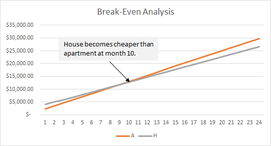

# Financial Analysis

## Chapter 1: Introduction
* **Accounting Analysis** deals with many types of costs. **Financial Analysis** deals with relative, future, and relevant costs. The two are separate and have different purposes.

## Chapter 2: Cost Concepts
* An analyst often has to capture the cost of doing something: buying a product, hiring a person, etc. Something related to either a product, project, system, or operation.

* Relative Cost: The analyst doesn't really care how much A costs, but they are interested in the difference in cost between A and B.
* Almost always dealing with future costs, or estimates.
* Be aware of the potential faulty accounting perspective of actual cost.

## Chapter 3: Break-Even Analysis
* Usually comparing an option which is cheaper in the near future but more expeince ve long term, or the other way around.
* Example: small home on 15 year mortgage vs. renting luxury apartment
  * Can determine the BE point using a chart or algebra and solving for M.
* Example: Fixed and variable cost for producing plastic book holders, solving for N.

## Chapter 4: Benefit/Cost Analysis
* Also known as Cost Effective Analysis.
* Frequently applied to government projects but can be applied to business venture.
* Two approaches: express all benefits of the project in monetary terms and equate with gains with the losses.
  * quantify benefits of the project using an arbitrary but consistent scale between two or more projects (Crabtree).
* Involves calculating the benefit/cost ratio. Sometimes the cheapest option isn't the best option.

## Chapter 5: Summary

## Assignment
List 5 factors other than salary that you would consider in choosing between two potential jobs.

